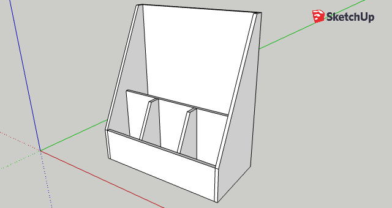

This is a relatively small size for cutoff store - ideal for small shops.

Originally I planned to not use a bottom for it so the plan shows an open
bottom. But the floor in my shop is quite uneven, so pretty soon after
completing it I decided to add a bottom as well as leveling legs, which can be
seen in the picture.

