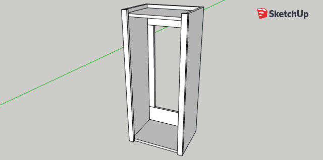
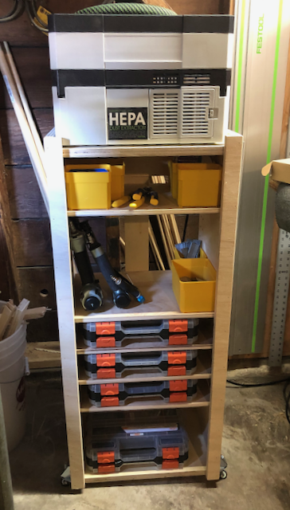

A stand that fits my dust extractor (Festool CT-SYS) perfectly, and raises it
up to a level that's convenient when using power tools. Below the DE, I drilled
shelf pin holes so shelves can be added as needed for additional tools, small
parts, etc.

