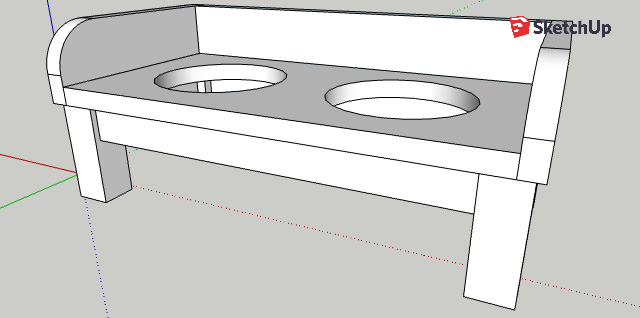

I built one of these for all our dogs, in different sizes. It is easy to
scale. For the bowls I use the Van Ness heavyweight crocks, in the appropriate
sizes.

Since dogs are messy eaters and drinkers, I finish these feeders with with
several coats of water-based poly, and also caulk the inside edges/corners
with silicone to prevent water damage to the plywood. This seems to work well,
though should the feeder start to break down, it would be quite simple to
replace the top half and reuse the leg assembly.

