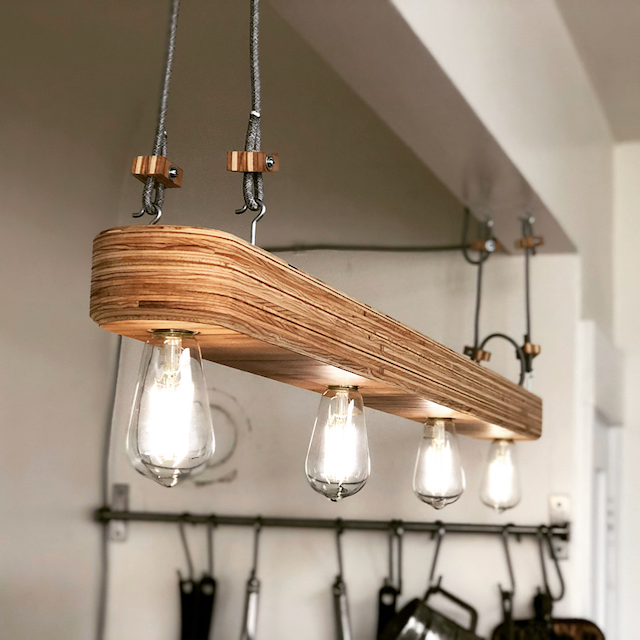
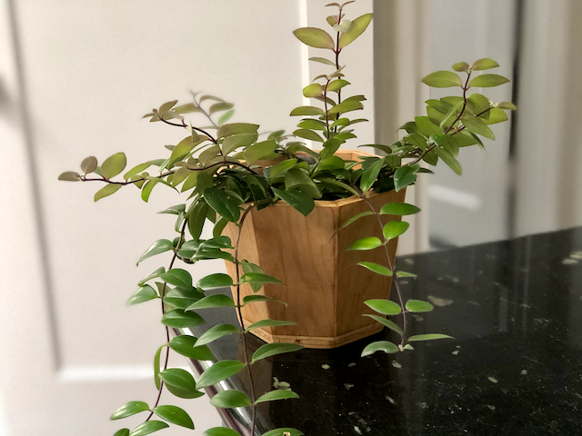
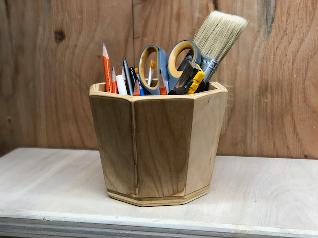
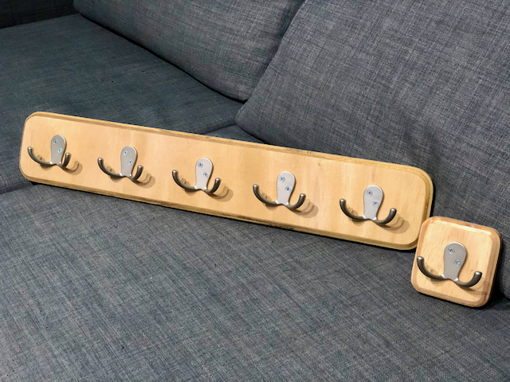
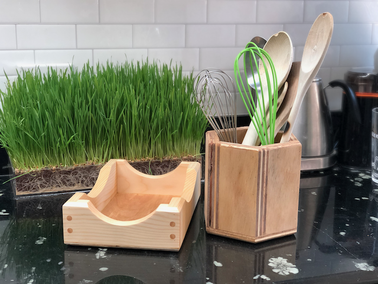
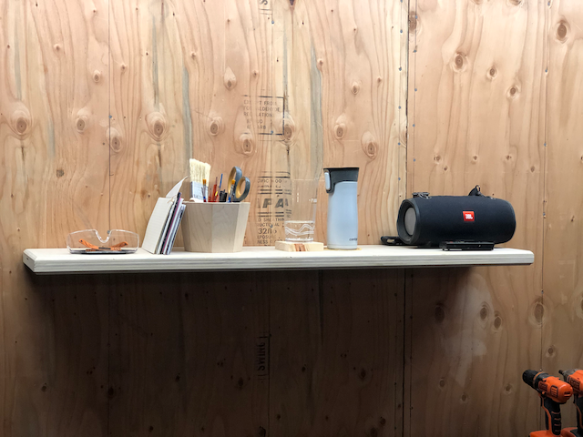

## Kitchen lamp

## Slanted octogons

The math on the cut angles on slanted polygons is extremely involved. Luckily,
there are people who figured it all out and [published handy
tables](https://woodgears.ca/miter/).

## Coat hangers

The math on the cut angles on slanted polygons is extremely involved. Luckily,
there are people who figured it all out and [published handy
tables](https://woodgears.ca/miter/)

## Fancy containers

## Floating shelf

