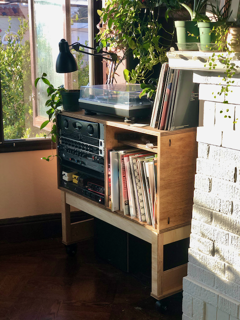
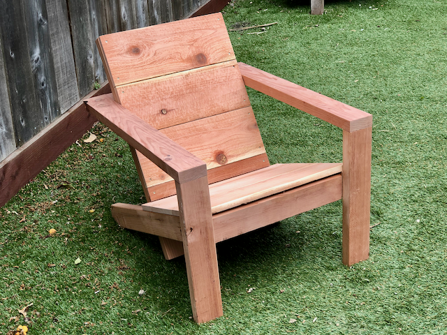
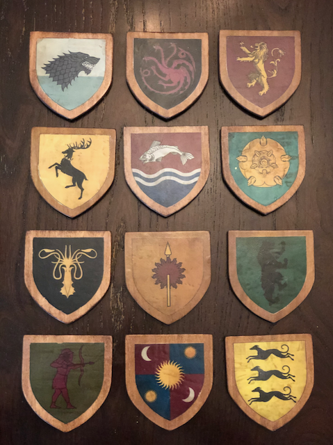

## Kitchen lamp

## Slanted octogons

The math on the cut angles on slanted polygons is extremely involved. Luckily,
there are people who figured it all out and [published handy
tables](https://woodgears.ca/miter/).

## Coat hangers

The math on the cut angles on slanted polygons is extremely involved. Luckily,
there are people who figured it all out and [published handy
tables](https://woodgears.ca/miter/)

## Fancy containers

## Floating shelf

## #blm sign

## Tidy cat feeders

## Music console

## Garden swing

## Modern Adirondack chair

Plan by [Ana White](https://www.ana-white.com/woodworking-projects/2x4-modern-adirondack-chair).

## Rolling planter box

## 10' x 10' x 10' backyard aviary for [rescue pigeons](https://pigeonrescue.org)

## Houses of Game Of Thrones coaster set

