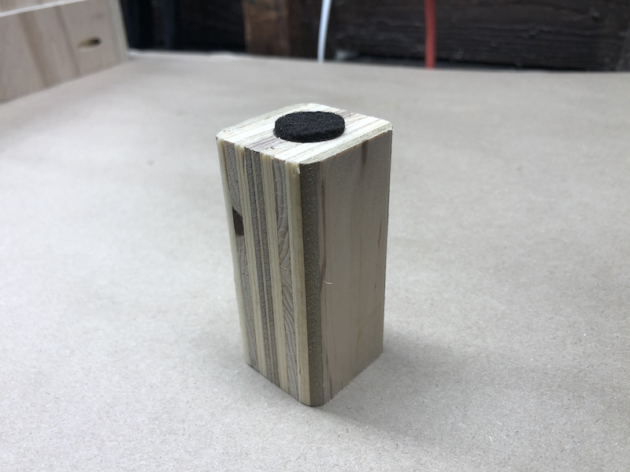
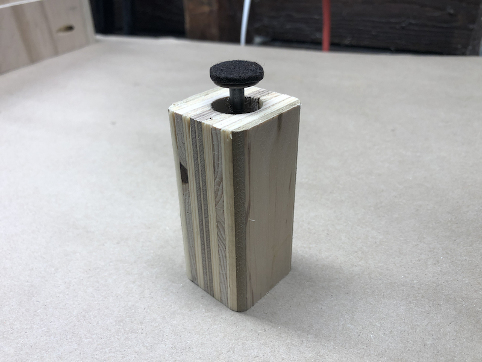
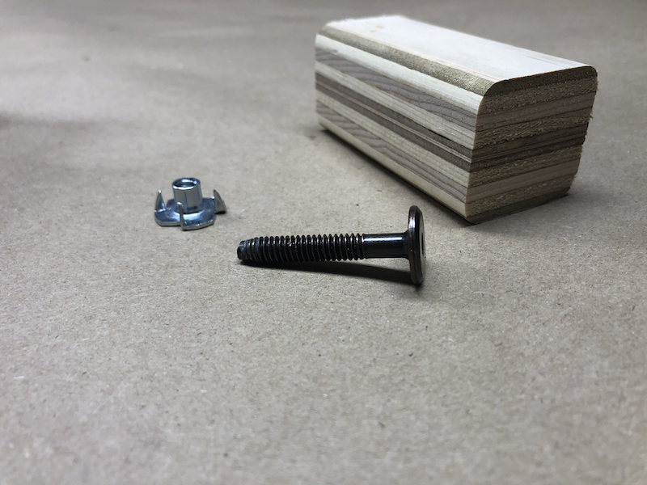
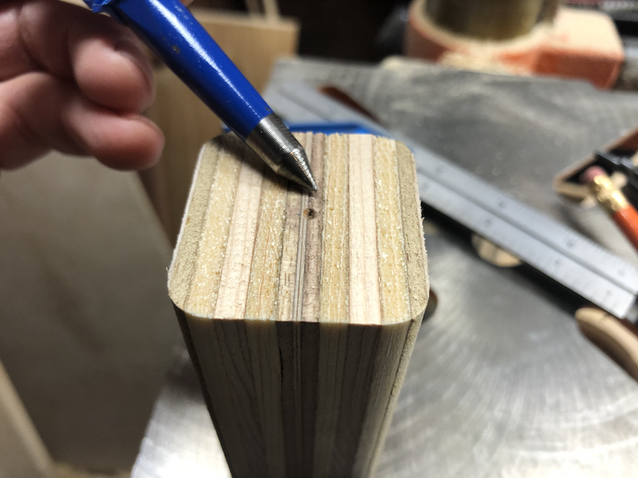
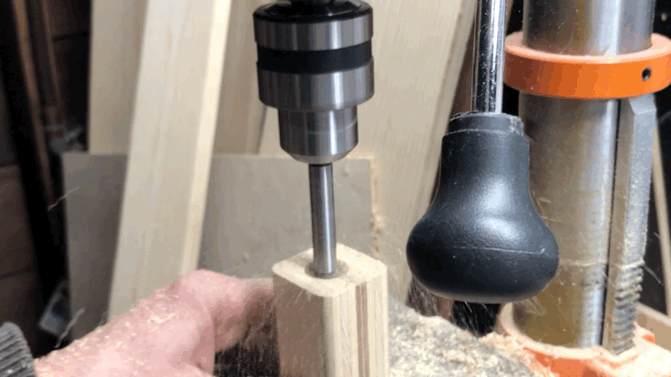
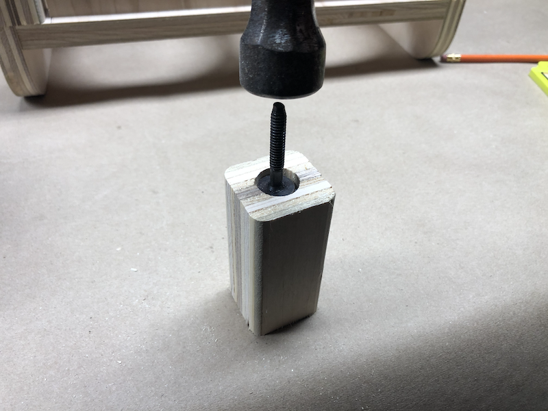
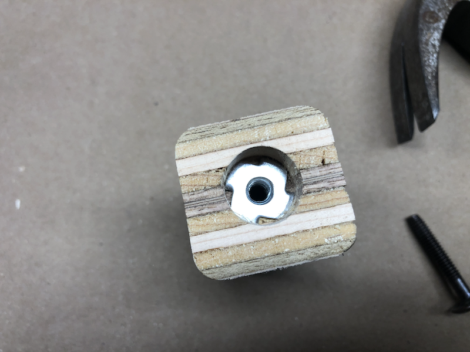
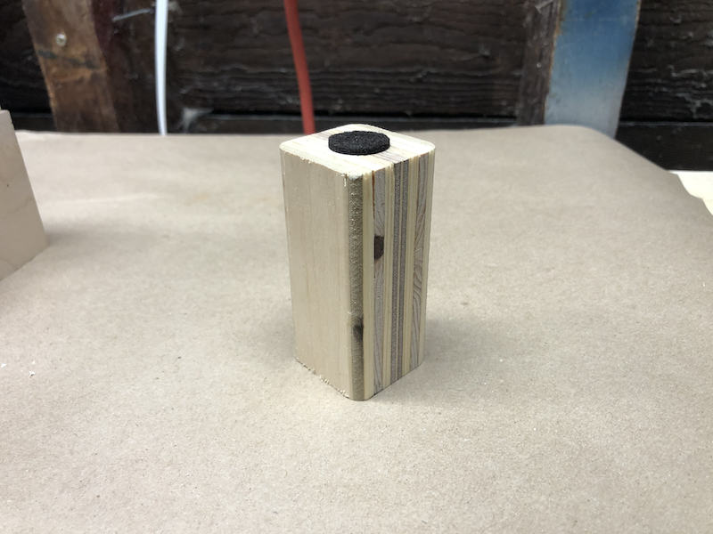
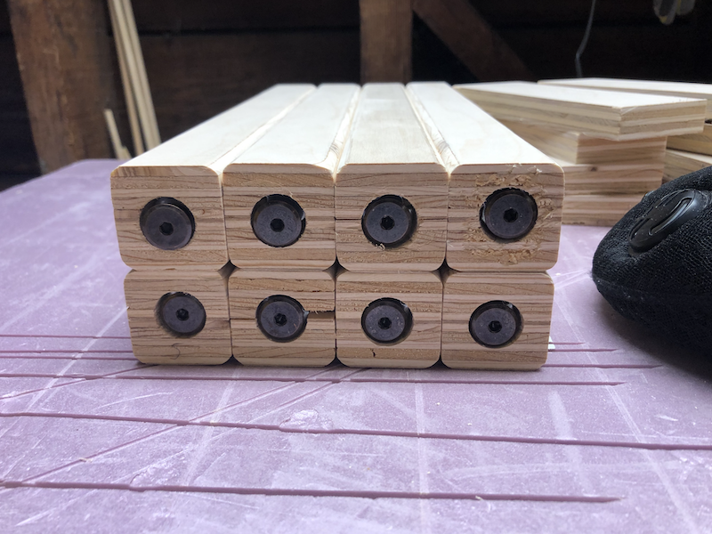

If you peruse the [gallery](../../gallery/), you might notice that most of my
furniture pieces feature rounded legs that look like this in close-up
(and unfinished):

I make these by laminating two 3/4" plywood panels together, then cutting to
size and rounding over the corners with a roundover bit in the router. However
that's not all -- though no casual observer will ever notice, virtually all 
of these legs have a built-in leveling mechanism:

I don't understand why not more commercial furniture (or woodworking plans)
feature leveling legs. I guess it's a cost / complexity issue, but I consider
them a must and not only to defend against less than 100% precision on the
furniture builder's part. Most floors are not fully level, so even the most
well built piece might wobble and have to be shimmed.

It is not an overstatement to say that I got into furniture building in large
part because I was so sick of dealing with wobbly furniture and wanted to show
that it's possible to have simple, cheap and discreetly hidden leveling legs
everywhere. So this workflow of leg building was one of the first things I
devised. (Of course I'm not claiming that this method of leveling is an
original idea.)

The leveling assembly I'm showing here costs pennies, and can be put into the
leg in under two minutes by drilling two holes. When fully closed, no one will
know it's even there.

To put it together, you only need a T-nut and a bolt that fits the nut and has
a flat, wide head. These often are called "elevator bolts". You can get them in
a variety of lengths and head sizes.

First, mark the center in the leg:

Then drill a hole that's the size of the T-Nut's outside diameter, in this case
3/4". A Forstner bit should be used in the drill, so the hole has a flat bottom
and is generally tidy. The hole should be deep enough to accommodate the T-Nut plus the bolt, when fully closed.

Next drill another, deeper hole into the center, which will accommodate the
bolt's shaft. Make sure the hole is deep enough for the whole length of the
bolt to fit inside the leg even if the leveler is closed all the way. Since I'm
using 1/4" bolts, I drill a 3/8" hole. (Sorry, I forgot to take a picture of
this step).

Then hammer the T-Nut into the hole. Here I simply use the bolt turned upside
down since it's head is also 3/4".

It all then should look like this:

Note the deeper hole in the center for the bolt's shaft.

If the leg will stand on hardwood or otherwise sensitive floors, stick a felt
pad on top of the bolt's head. And you're done!

I build a lot of these, and they always prove to be a great addition to the
piece I'm working on.

NOTE: This setup will work best for light-duty furniture. If you build e.g. a
heavy table that's moved (dragged) around a lot, it's possible for the dragging
to loosen T-Nut to and for the whole assembly to fall out of the leg.
I'd probably use a different leveler method for such furniture.

