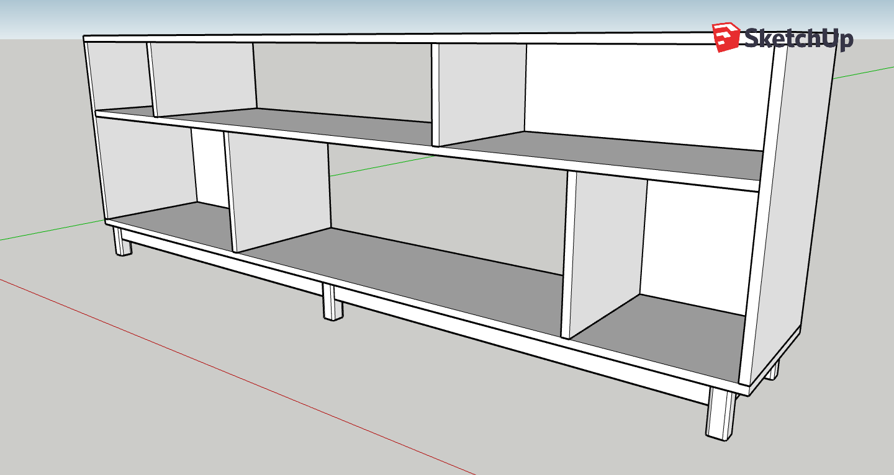

A generic and fairly straightforward shelf plan. This basic design can be
adapted for many purposes (bookcase, media console, shoe rack, closet
organizer...) by scaling the size up and down, changing the number of shelves,
vertical supports etc. 

Note that these plans include some backing boards, ie. not all of the "cubbies"
are open to the back wall. Most similar builds I see online do not include such
backers, but I think including a few of them is very important (particularly if
you place something heavy on top like a TV) as it provides stability against
sideway shear forces. As designed here, these shelves not only look good, but
they are also extremely sturdy.

